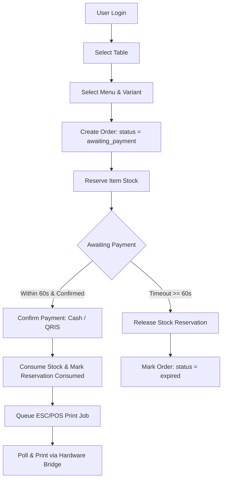
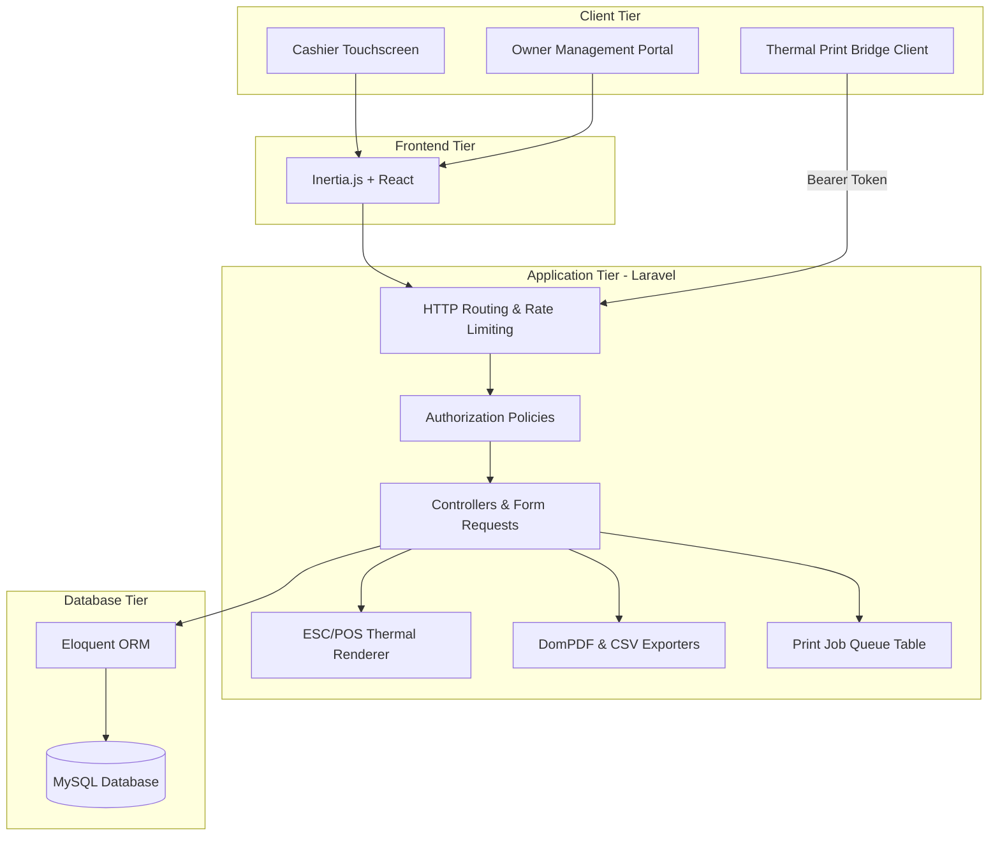
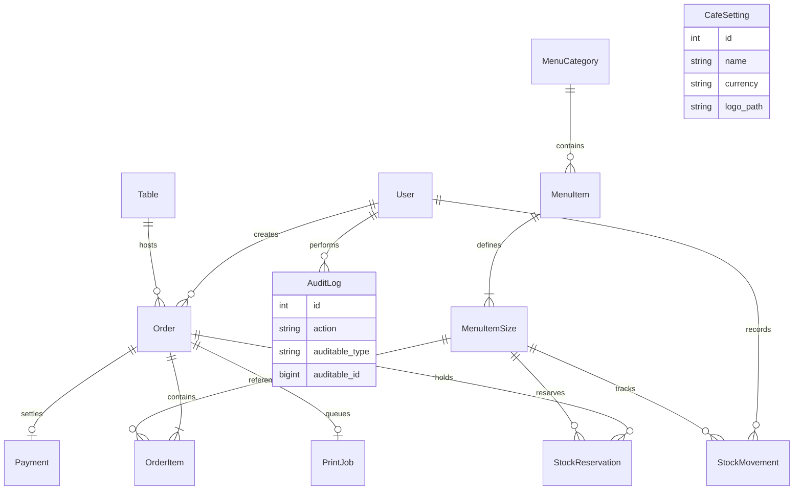
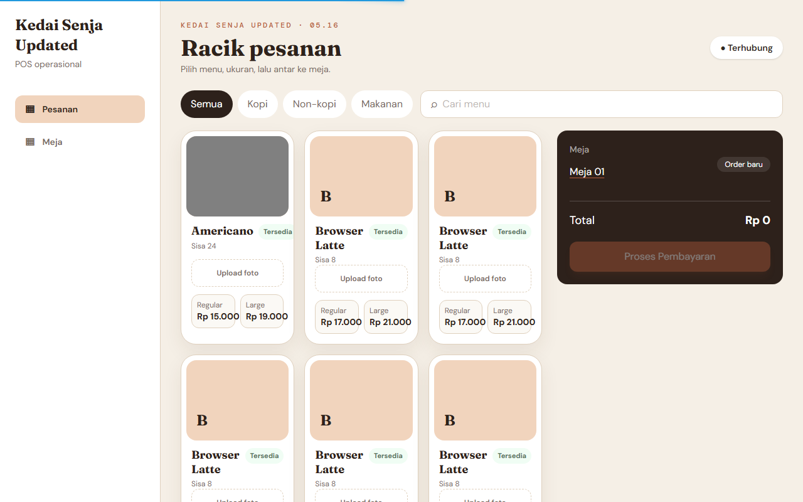
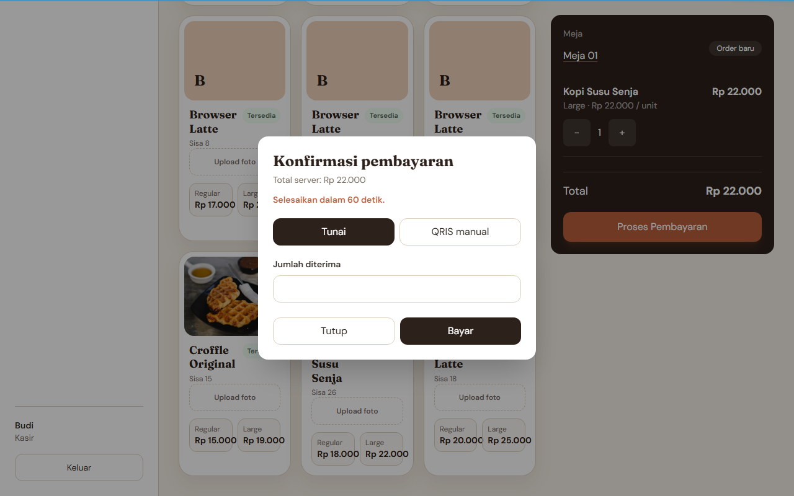
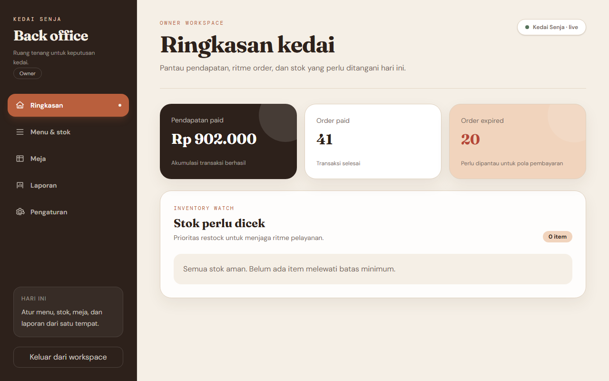
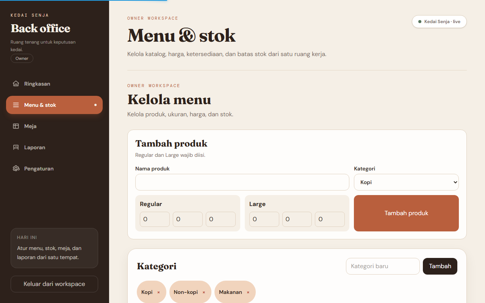
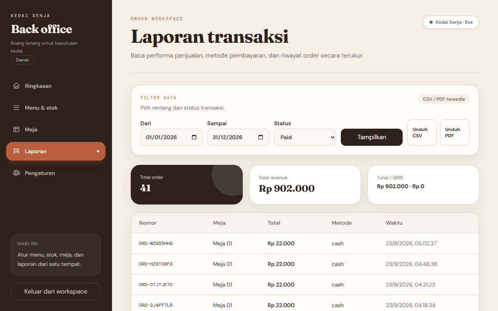

# Cafe POS — Cashier & Owner Management System

Full-stack Point of Sale system for cafe operations with cashier workflows, owner back-office, inventory control, reporting, and thermal receipt printing.

**Tech Stack**: Laravel · Inertia.js · React · MySQL · Playwright

---

## Overview

Cafe POS is a single-branch cafe management and point-of-sale application designed for tablet-oriented cashier operations and owner back-office administration. The system manages table-first order creation, menu configuration with multiple beverage sizes, automated payment expiration, and asynchronous 58mm thermal receipt generation.

All monetary calculations, stock deductions, and permission boundaries are enforced strictly on the server. The platform includes inventory reservation during payment windows, concurrency control for stock allocation, an external print bridge API, and aggregated owner reporting with CSV and PDF export capabilities.

---

## Tech Stack

### Backend
- **PHP**
- **Laravel**
- **Eloquent ORM**

### Frontend
- **Inertia.js**
- **React**
- **Tailwind CSS**
- **Vite**

### Database
- **MySQL**

### Testing
- **PHPUnit** (Feature, concurrency, and authorization testing)
- **Playwright** (Headless browser end-to-end testing)

### Reporting
- **DomPDF** (PDF daily and range sales reports)
- **CSV Export** (Native stream export)

### Hardware & Printing
- **ESC/POS Receipt Generation** (58mm thermal layout with raster logo)
- **Print Bridge API** (Asynchronous polling and status reporting)

---

## Business Workflow



---

## System Architecture



---

## Role Matrix

| Role | Main Responsibilities |
|---|---|
| **Owner** | Administrative operations: dashboard metrics, menu and category management, price and stock threshold updates, table floor plan, sales reports with CSV/PDF export, cafe identity settings, and receipt audit access. |
| **Cashier** | Daily point-of-sale workflow: table-first order creation, Regular/Large variant selection, cash and manual QRIS payment processing, receipt reprint, failed print retry, and table status updates. |
| **Print Bridge** | Machine-to-machine client: polls next pending print job via Bearer token, receives base64 ESC/POS payload, and reports final print status (`printed` or `failed`). |

---

## Key Features

### Cashier
- **Table-First Ordering**: Cashiers assign an active table before selecting items.
- **Variant Selection**: Regular and Large beverage and food options.
- **Server-Side Pricing**: Unit prices and line totals computed on the server using integer Rupiah.
- **60-Second Payment Window**: Dynamic countdown timer coupled with server-side expiration checks.
- **Payment Processing**: Cash calculation with change computation and cashier-verified manual QRIS.
- **Receipt Access & Reprint**: Dedicated 58mm ESC/POS receipt generation for paid orders.

### Inventory
- **Stock Reservation**: Two-phase lifecycle (`reserved` -> `consumed` on payment, or `released` on expiration).
- **Pessimistic Concurrency**: Row locking (`lockForUpdate`) during order reservation and payment settlement.
- **Stock Movement Ledger**: Full audit history for stock adjustments, reservations, consumptions, and releases.
- **Low Stock Watch**: Visual indicator and reporting for items below defined minimum thresholds.

### Owner Back-Office
- **Dashboard**: High-level financial KPIs, popular products, and critical stock alerts.
- **Menu & Category Management**: Categorization, item availability toggles, and photo uploads.
- **Price & Inventory Control**: Direct modification of variant prices, on-hand inventory, and alert thresholds.
- **Table Management**: Setup table identifiers and manage room capacity.
- **Reports & Export**: Aggregated sales summaries with paginated order histories, CSV stream export, and DomPDF generation.
- **Cafe Settings**: Brand name, address, contact details, currency, and receipt logo configuration.

### Printing & Hardware Bridge
- **ESC/POS 58mm Renderer**: Native generation of thermal command sequences including monochrome raster logo conversion.
- **Asynchronous Queue**: Print jobs queued in database during payment to keep cashier checkout responsive.
- **Retry Mechanism**: Cashiers can re-queue failed print jobs from their workspace.
- **Bearer Token Bridge**: Authenticated endpoints allowing local hardware daemons or Android OTG clients to poll and execute jobs.

---

## Transaction Integrity

The system includes concurrency controls and transactional safeguards to ensure financial and inventory reliability:

- **Server-Side Verification**: Client inputs specify only IDs and quantities. Prices, line totals, and final billing amounts are calculated on the server from active database records.
- **Integer Rupiah Values**: Monetary calculations avoid floating-point inaccuracies by storing and computing whole integers.
- **Pessimistic Row Locking**: Inventory transitions and order confirmations use `DB::transaction()` with `lockForUpdate()` to prevent overselling during simultaneous checkout attempts.
- **Idempotent Payment Handling**: Each payment requires a unique idempotency key. Duplicate requests return the confirmed payment record without duplicating stock deductions.
- **Automatic Expiration & Stock Release**: If an order is not completed within 60 seconds, reserved stock is released back to available inventory and logged in the stock movement ledger.
- **Atomic State Transitions**: Order status updates, payment records, inventory deductions, stock movement entries, and print job dispatch occur within a single database transaction.
- **Concurrency Test Suite**: Verified via automated multi-process concurrency tests simulating simultaneous checkouts against finite inventory.

---

## Testing

Automated testing covers feature logic, authorization boundaries, concurrent inventory operations, and browser interactions.

### Backend Tests (`php artisan test`)
- **75 Tests / 262 Assertions**
- **Scope**:
  - Authentication and role isolation
  - Table-first order lifecycle and validation
  - Payment execution, change calculation, and QRIS validation
  - Concurrent stock reservation and race condition safeguards
  - Order expiration and automatic reservation release
  - Receipt view authorization for owners and cashiers
  - Report filtering, SQL aggregations, and pagination
  - Menu photo uploads and file validation
  - Print bridge token authorization and state updates

### Browser E2E Tests (`npx playwright test`)
- **20 Playwright Tests**
- **Scope**:
  - Cashier order creation and cash checkout flow
  - Payment expiration alert and 60-second countdown behavior
  - Role-based route protection (cashier denied owner routes)
  - Navigation, table status updates, and menu category filtering
  - Owner dashboard, catalog management, settings updates, and report pagination
  - Menu photo uploads for owner and cashier roles
  - Cashier and owner session logout

---

## Database Model



---

## Project Structure

- `app/` — Application controllers, middleware, models, policies, and ESC/POS rendering service.
- `resources/js/` — Inertia React pages, cashier workspace, owner back-office layouts, and UI components.
- `database/` — Database migrations, seeders, and factories.
- `routes/` — Web, API, and print bridge route definitions with role and rate-limiting middleware.
- `tests/Feature/` — PHPUnit backend integration, stock concurrency, and authorization tests.
- `tests/browser/` — Playwright end-to-end browser tests and interaction specifications.

---

## Local Setup

### Prerequisites
- PHP 8.3+ with `pdo`, `mbstring`, `gd`, and `curl` extensions
- Composer 2+
- Node.js 20+ and npm
- MySQL 8.0+

### Setup Instructions

1. Clone repository and install dependencies:
   ```bash
   git clone https://github.com/chandra7251/casher_and_owner.git
   cd casher_and_owner
   composer install
   npm install
   ```

2. Configure environment:
   ```bash
   cp .env.example .env
   php artisan key:generate
   ```

3. Configure database credentials in `.env`:
   ```env
   DB_CONNECTION=mysql
   DB_HOST=127.0.0.1
   DB_PORT=3306
   DB_DATABASE=cafe_pos
   DB_USERNAME=root
   DB_PASSWORD=your_password
   ```

4. Run migrations and database seeder:
   ```bash
   php artisan migrate --seed
   php artisan storage:link
   ```
   > **Note**: `DatabaseSeeder` is intended for initial setup on a fresh database. If resetting an existing database, run `php artisan migrate:fresh --seed`.

5. Build assets and launch the development server:
   ```bash
   npm run build
   php artisan serve
   ```

### Default Credentials (LOCAL DEMO ONLY)

| Role | Email | Password |
|---|---|---|
| **Owner** | `owner@kedaisenja.test` | `change-this-local-password` |
| **Cashier** | `kasir@kedaisenja.test` | `change-this-local-password` |

*(Credentials are intended for local development and demonstration only).*

---

## Test Commands

### Backend Test Suite
```bash
php artisan test
```

### End-to-End Browser Test Suite
```bash
npx playwright test
```
> **Deterministic Server Lifecycle**: Playwright automatically manages its own Laravel server process on port `8765` and polls `/api/health` before executing browser specs. Running `php artisan serve` manually beforehand is not required.

### Asset Compilation
```bash
npm run build
```

---

## Screenshots

Screenshots are stored in `docs/screenshots/` and captured from the real local application with Playwright.

### Cashier Workspace


### Payment Modal


### Owner Dashboard


### Owner Menu


### Owner Reports


---

## Print Bridge

The POS system communicates with thermal receipt printers through a token-authenticated bridge protocol:

- `GET /api/print-jobs/next` — Atomically queries and marks the oldest queued print job as `printing`.
- `PATCH /api/print-jobs/{id}` — Updates job status to `printed` or `failed` with failure details.
- **Authentication**: Requires a Bearer token matching `PRINT_BRIDGE_TOKEN` configured in environment settings.
- **Payload**: Print jobs return an ESC/POS base64 payload ready for direct transmission to thermal hardware.

---

## Security Notes

The application enforces standard web application security practices:

- **Session Regeneration**: Regenerates session IDs upon login to defend against session fixation.
- **Role Middleware**: Enforces explicit boundaries between `owner` and `cashier` user accounts.
- **CSRF Protection**: All mutating HTTP requests require valid CSRF tokens.
- **Input Validation**: FormRequests validate and sanitize all user submissions.
- **MIME Type Allowlist**: Photo uploads validate file extensions and MIME types (`image/jpeg`, `image/png`, `image/webp`).
- **Rate Limiting**: Rate limiters configured for mutation endpoints (60/min) and print bridge queries (120/min).
- **Constant-Time Comparison**: Print bridge tokens are evaluated using `hash_equals()`.
- **Policy Authorization**: Explicit Laravel Policy authorization guards receipt views, payments, and order modifications.

---

## Engineering Notes

- **Payment Timeout**: The payment window is currently fixed at 60 seconds across frontend countdown and backend expiry logic.
- **Database Seeding**: `DatabaseSeeder` is non-idempotent on rerun without resetting tables (`migrate:fresh`).
- **Frontend Request Layer**: Frontend currently utilizes native `fetch()` calls with CSRF headers alongside Inertia form handling.
- **CI Pipeline**: Automated continuous integration workflows are planned for subsequent infrastructure iterations.
